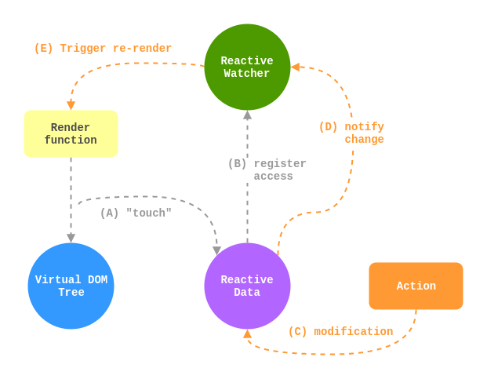
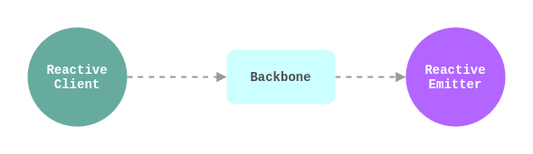
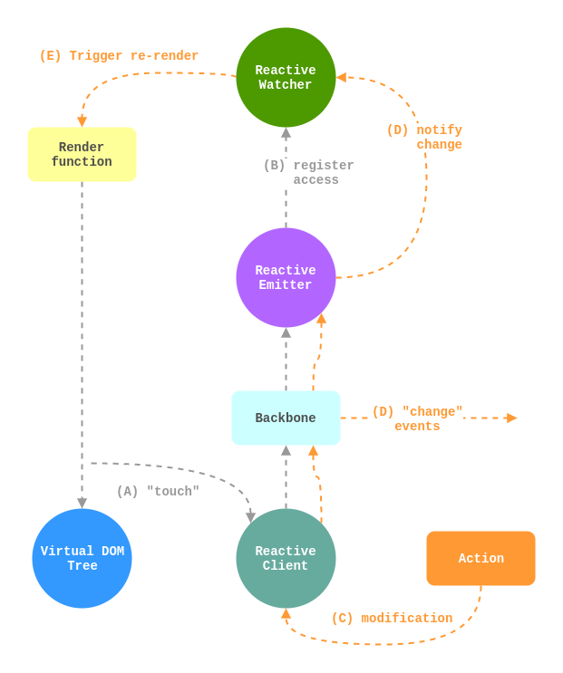

# Concept

As mentioned in the introduction, Vue data is made of simple objects (POJOs) and the logic applied to the data is separated from the data itself. Any developer familiar with Backbone will know the core storage of a Model is also made up of simple object(s) or types. See [`model.attributes`](http://backbonejs.org/#Model-attributes) and [`collection.models`](http://backbonejs.org/#Collection-models).

A normal Vue instance has **reactive** data, which is accessed by various logical constructs (e.g. Computed, Watchers, Template expressions etc), which once modified will trigger Vue to re-render automatically (using its convenient Virtual DOM).

This has many similarities with Backbone, which provides `change` events to allow Views re-render/update when necessary.

## Reactivity Overview

Vue Backbone is possible due to Vue's [**reactivity**](https://vuejs.org/v2/guide/reactivity.html), which is where raw access to simple objects (POJOs) can be intercepted, a full explanation can be found in Vue documentation, but here is a modified version of Vue's diagram:

## Vue Backbone Architecture

What was a single node in the diagram, _Reactive Data_, is now replaced with 3 nodes. The read/write access to the data will now enter the _Reactive Client_ node, and the watcher output from _Reactive Data_ will now come from _Reactive Emitter_.

### What does this mean?

* _Reactive Client_ can provide an interface with simple objects (POJOs).
* _Reactive Client_ will interact with the _Backbone_ interface, meaning Backbone's own behaviour is used and maintained (events etc).
* Backbone-originating access or changes will also trigger registrations/notifications from the _Reactive Emitter_.
* While Logic is still being moved to Vue logical constructs, Backbone's own functions will be accessible via the _Reactive Client_ (more detail in [Usage Guidelines](/guidelines.md)). Which will in turn trigger reactive registration where necessary.
* Once all Backbone-originating logic has been migrated to Vue, these 3 nodes can be replaced by a Flux library (or even Vue's own reactive data).

### Tightly Coupled?

If Backbone is going to emit reactive registrations/notifications, how tight is the coupling? Thankfully **Data Reactivity** can be achieved without the consumer of the data being aware, it is an excellent example of the [Proxy Pattern](https://en.wikipedia.org/wiki/Proxy_pattern).

When a Backbone object is used with Vue, it's underlying data structure is made reactive unbeknownst to Backbone.

### Limitations

Just as with Vue's own reactivity, the **addition/deletion** of data within a Backbone Model after its initialization, will not be detected by Vue Backbone.

Vue’s recommended workaround is to initialize all properties upfront, which is a good practice anyway.
 
For a Backbone Model, the same could be done. Though it doesn’t mean the model `defaults` need to describe each attribute, in the case of a model populated by a RESTful API response, at construction time the data will be available. Though, watch out for absent attributes that could be later added, they might be best described in `defaults`.